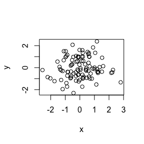

Cm004
================

This is a level one header
==========================

This is a level two header
--------------------------

This is a line of text.

-   bullet 1
-   bullet 2

``` r
x <- rnorm(100)
y <- rnorm(100)
plot(x,y)
```



``` r
summary(x)
```

    ##    Min. 1st Qu.  Median    Mean 3rd Qu.    Max. 
    ## -2.5640 -0.6027 -0.0124  0.0265  0.6264  2.8040

``` r
x <- rnorm(100)
```
